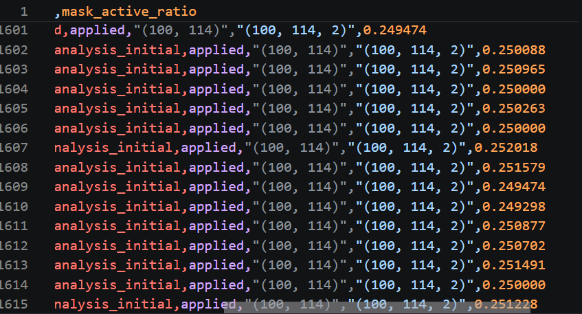
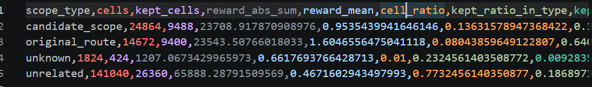
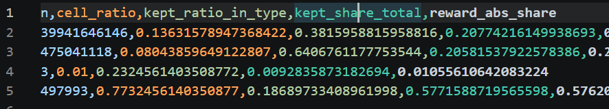

# 2026-7-14

## 1、为什么加 reward scope
原来的 reward 是给整个 car × road 矩阵都生成值。当前小规模实验里有 100 辆车 × 114 条路 = 11400 个 reward 位置。但对一辆车来说，它真正会走到的路只是一小部分。很多路离它很远，或者和它的路线没有关系。如果这些无关位置也都有 reward，DQN 学到的信号就会很散。

所以加 reward scope 的目的就是：先把更可能有用的位置挑出来，让 reward 主要作用在这些位置上。

当前用了两个简单规则：
- 距离近的位置更容易保留（距离近说明这条路更可能和这辆车当前路径有关。）
- queue 比较高的位置更容易保留（queue 高说明这条路可能比较堵，是更需要优化调整的地方）

先保留那些“更可能影响车辆怎么走”和“更可能影响拥堵”的位置。

## 2、怎么做
每辆车保留一部分距离比较近的 road。
每辆车保留一部分 queue 比较高的 road。

这些被选中的位置，mask 就是 True：
- `mask = True` → reward 保留
- `mask = False` → reward 压低或者置零

## 3、结果

`mask_active_ratio ≈ 0.25`：大约 25% 的 reward 位置被保留，大约 75% 的 reward 位置被压低或置零。说明代码上 reward scope 已经生效了。

原始路径 + 候选绕行只占 21.67% 的格子，但占了 41.35% 的保留 reward。说明按 distance 和 queue 筛选以后，reward 确实比之前更集中到可能有用的位置了。

再看 rho。与同 seed 对照结果是：
- seed42: baseline = 0.137232, scope = 0.142979, 提升 0.005747
- seed43: baseline = 0.138460, scope = 0.157020, 提升 0.018560
- seed44: baseline = 0.141659, scope = 0.136960, 下降 0.004699

reward scope 确实生效了，也会影响 rho，但目前还不能稳定提高 rho。

## 4、当前问题和下一步
虽然原始路径和候选绕行的 reward 占比提高了，但无关位置仍然占比较大，超过一半的保留 reward 仍然落在无关位置。

可能原因是当前 `apply_reward_scope` 只接收 `tau`，主要依靠 distance 和 queue 来筛选，只能粗略判断哪些位置可能重要。

粗筛 mask 在某些 seed 下保留到了有用位置，所以 rho 提升；但在另一些 seed 下，它可能把有用的绕行位置压掉了，导致 rho 下降。

下一步把 reward scope 从 distance/queue 粗筛，改成 `original_route + candidate_scope + 瓶颈上下游` 的精确筛选。