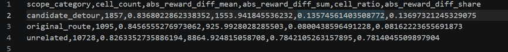
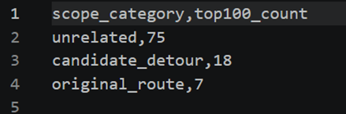
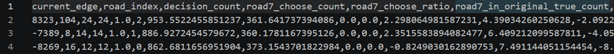
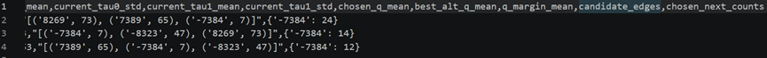
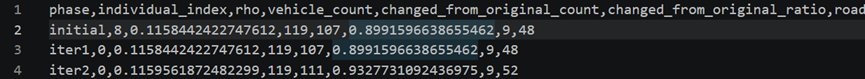

# 20260703

## 一、reward 的作用范围太大，很多改动没有作用到真正有用的位置

当前 reward 是定义在整个 car × road 空间上的。在这个小规模实验里车辆数是120，路段数是 114，所以总的车-路格子数是 13680。但实际上，一辆车真正会走到的路，只占这里面很小的一部分。也就是说，reward 的可修改空间很大，但真正和行驶决策强相关的部分很少。

把车-路矩阵分成原始路径、候选绕行路径和无关位置三类。可以看到，无关位置占全部格子的 78.42%，同时也承载了 78.14% 的 reward 变化量；原始路径和候选绕行位置加起来只承载了大约 21.86% 的变化量。

reward 变化最大的前 100 个格子里，有 75 个仍然是无关位置，只有 7 个在原始路径上，18 个在候选绕行位置。

总结：说明当前 reward 的改动大部分没有集中落在真正影响路径决策的位置上，而是分散在大量无关格子里，导致有效引导信号被摊薄，难以集中作用到真正重要的路段上。这会直接削弱 reward 对 DQN 路径学习的引导效果。

## 二、DQN 对局部决策的表达太弱，容易在关键路口学成“固定偏好”

当前算法输入状态主要还是局部的 distance 和 queue。没有把“候选下一条路本身的特征”真正作为动作比较的一部分显式喂进去。这就会导致：同一个路口上，不同车虽然目标不一样、后续路径不一样，但如果当前看到的局部状态差不多，DQN 很可能就给出很像的动作。

举例：road_index = 7。它对应的边是 -7384，发现是个比较像瓶颈的位置：初始 tau1_queue 很高，上游有多个入口，下游再分流出去。所以如果模型学得合理，应该在上游就学会区分哪些车该进这里，哪些车该提前绕开。

在 road 7 的几个上游入口处，DQN 几乎 100% 选择将车辆引入 road 7，即使这些车辆在原始路径中大多并不需要经过该路段。这说明模型在这些局部节点上没有学会区分不同车辆，而是形成了统一入口偏好。

模型并不是没有改路，相反，大约九成以上车辆的规划路径都和原始路径不同。但与此同时，经过 road 7 的车辆数却从原始的 9 辆增加到了 48 到 52 辆，说明改路方向并没有避开瓶颈，反而把更多车辆集中到了这里。

总结：当前 DQN 的局部状态主要基于距离和排队信息，缺少对候选下一路段差异的显式表达。在关键瓶颈 road 7 的上游节点上，模型对不同车辆几乎都做出了相同选择，100% 引导其进入 road 7。这说明 DQN 学到的不是细粒度的分流策略，而是固定入口偏好，导致大量车辆被错误汇聚到瓶颈路段。

# 20260710

## 一、reward 作用范围太大，会让 rho 提升变慢、变弱、变不稳定

当前reward是定义在整个 car × road 空间上的，但真正和车辆实际决策强相关的，只是其中一小部分位置。当前问题对rho的影响：

1. reward 改了，不等于车就会在关键位置改。因为信号被摊薄后，真正有用的那部分太弱。**那么会导致 reward 变化很多，但 rho 不怎么动。**
2. 如果很多reward改动都落在无关格子里，那不同个体之间的差别，可能带有较强偶然性。有些个体可能碰巧改对一点，就拿到稍高 rho；有些则没有。**那么会导致 rho 的提升不够稳定，个体间波动偏随机。**
3. 进化阶段是按rho留个体。但如果reward空间里大部分变化本身就无效，那进化在筛选时，相当于是在一个“噪声很多”的空间里挑。**那么会导致好个体和一般个体的差距不明显，进化难以持续累积有效改进，rho上升幅度会被压住。**

如果把 reward 的作用范围缩到更有意义的位置，比如原始路径附近、可行绕行候选附近、局部瓶颈相关区域，那么reward 改动会更集中地作用在真正影响路径选择的位置上，也不会靠“碰巧改对几个无关格子”，而是更系统地影响关键路段。进化阶段更容易筛出真有效个体，高 rho 会更真实地反映“reward 是否改到了关键位置”。

## 二、DQN 局部表达太弱，会让 rho 朝错误方向变化，甚至把系统推向瓶颈

具体来说：

1. 如果 DQN 在关键路口只会“统一选某条路”，那它就做不出真正细粒度的分流。即使 reward 设计得还行，最终也很难把交通组织优化到更好。**这会直接限制rho 能提升到的最高水平。**
2. 从先前分析可知九成以上车辆路径都改了，但经过 road 7 的车大幅增加。这说明 DQN 不是静止的，而是在积极改路。只是这个改路方向不对。**所以会出现行为变化很大，但 rho 提升很小。**
3. 因为每一轮进化都依赖当前个体的 rho 来筛选。如果 DQN 的表达能力本身就不够，它生成的策略上限就低，reward 即使变得更合理也可能被 DQN“翻译坏了”，最后导致进化阶段一直在一个较低水平附近打转，**rho 很难明显突破。**

如果解决这个问题路径优化会真正作用到拥堵结构上，而不是只做表面改路，rho提升幅度会更大。高 rho 个体更可能是真的学到了更好的分流，而不是偶然碰巧，rho 会更能反映策略质量。DQN 不再把 reward 信号“粗暴翻译成统一动作”，而是能更细地执行优化意图，后续进化更有积累性。
