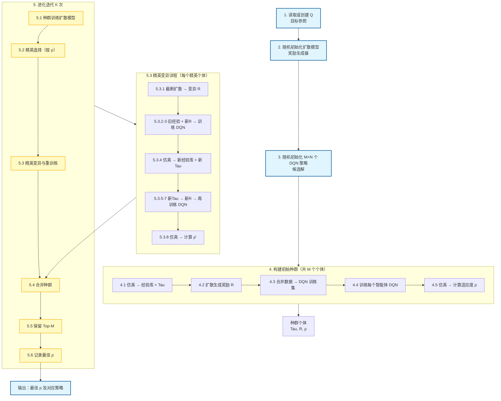

# 主流程各步骤与优化问题的对应关系
## 问题定义回顾

我们考虑一个完全协作的多智能体任务，建模为分散式马尔可夫决策过程（Dec-MDP）。核心数学形式如下：

$$
\min \sum_{t=1}^T \|X_t - X^*_t\|
$$

$$
\text{s.t. } \pi_k = \arg\max_{\pi_k} \mathbb{E}\left[\sum_{t=1}^T \gamma^t r_{k,t}\right],\quad r_{k,t}=R_k(s_t,a_t)
$$

其中：
- **目标**：让涌现的宏观状态序列 \(X_t\) 尽可能接近目标宏观状态序列 \(X^*_t\)。
- **约束**：每个智能体的策略 \(\pi_k\) 必须是在其自身奖励函数 \(R_k(s_t,a_t)\) 下的**最优策略**（最大化累积折扣奖励）。

MASDiff 的主流程通过 **种群进化 + 扩散生成奖励 + DQN 训练策略** 来同时搜索合适的 \(R_k\) 和 \(\pi_k\)，并保证 \(\pi_k\) 相对于 \(R_k\) 是最优的。

---

## 各步骤与优化问题的对应关系

### 步骤 1：读取或创建 Q

- **Q 是什么？**  
  在实现中，\(Q\) 就是目标宏观状态序列 \(X^*_t\) 的具体数据形式（例如某次基准仿真的排队长度记录）。
- **作用**：提供评价基准，后续计算 \(\rho\)（适应度）时需要与 Q 比较，从而量化 \(\|X_t - X^*_t\|\)。  
  这一步是**定义优化目标的参照物**。

### 步骤 2：随机初始化扩散模型

- 扩散模型负责从条件信息 **Tau** 生成奖励矩阵 **R**（即 \(R_k(s_t,a_t)\) 的离散化表达）。
- 初始随机化：探索起点，后续通过种群训练逐步学会生成能带来高 \(\rho\) 的奖励。  
  这一步是**实现奖励函数生成器**，用于构造约束中的 \(R_k\)。

### 步骤 3：随机初始化策略（DQN），数量 \(M \times N\)

- 为种群中的每个个体（共 \(M\) 个）的每个智能体（共 \(N\) 个）生成初始随机策略。
- 这些策略是**候选解**，后续会针对生成的奖励进行训练，使其满足“策略是奖励下的最优”这一约束。

### 步骤 4：构建初始种群（循环 \(M\) 次）

#### 4.1 用随机策略仿真，收集经验库和 Tau
- **经验库**：每个智能体的 \((s, a, r)\) 轨迹，其中 \(r\) 暂时留空。
- **Tau**：条件特征（如当前道路到终点的距离、排队长度等），用于后续生成奖励。
- **作用**：获得**状态分布和动作序列**，为后续奖励生成和策略训练提供原始数据。

#### 4.2 把 Tau 作为扩散模型的条件，生成奖励 R
- 扩散模型输出 **R**，即每个智能体在不同状态-动作下的奖励值（或权重）。
- 这一步**显式构造了约束中的 \(R_k\)**。

#### 4.3 将经验库和 R 合并形成 DQN 训练数据
- 用生成的 R 填充经验库中的 \(r\) 字段，得到完整的 \((s, a, r)\) 样本。
- **作用**：将奖励函数 \(R_k\) **落实到具体数值**，使策略可以从中学习。

#### 4.4 为每个智能体训练一个 DQN
- 对每个智能体，用填充后的数据训练 DQN，目标是最小化 TD 误差，从而逼近最优动作值函数。
- 这一步**强制执行约束条件**：训练后的策略 \(\pi_k\) 是相对于该奖励 \(R_k\) 的最优策略（DQN 收敛时满足 Bellman 最优性）。

#### 4.5 用训练好的 DQN 仿真，计算 \(\rho\)
- 仿真得到宏观数据（与 Q 结构相同），然后由 Metric 计算 \(\rho\)（例如 \(\rho = \frac{1}{1+\text{MSE}(X,X^*)}\)）。
- **\(\rho\) 直接反映目标函数**：\(\rho\) 越大，\(\|X_t - X^*_t\|\) 越小。
- 最终形成个体 \((Tau, R, \rho)\)，同时保存经验库和策略（实际可能不存策略以节省内存）。
- **至此，一个可行解（满足约束的 \(R,\pi\)）被生成，并给出了它的目标函数值（通过 \(\rho\)）。**

### 步骤 5：进化迭代 \(K\) 次

#### 5.1 用当前种群训练扩散模型
- 种群中每个个体都包含 \((Tau, R)\)，且 \(\rho\) 高的个体代表“好的奖励函数”。
- 训练扩散模型学习从 Tau 到 R 的条件分布，使其**倾向于生成能带来高 \(\rho\) 的奖励**。
- **作用**：**隐式优化外层目标**，让奖励生成器朝着减小宏观误差的方向进化。

#### 5.2 根据 \(\rho\) 选择精英种群
- 保留当前表现最好的若干个体（例如 \(\rho\) 最大的前 20%）。
- **作用**：**选择操作**，保留优秀的 \((R,\pi)\) 组合，用于后续变异和探索。

#### 5.3 对每个精英个体进行截断扩散变异并重训练

##### 5.3.1 截断扩散生成变异后的 R
- 在精英原有的 R 基础上，加少量噪声再去少量噪声，产生邻域内的新奖励。
- **作用**：**局部搜索**，在优秀奖励附近探索可能更好的奖励函数。

##### 5.3.2～5.3.3 用新 R 和原经验库训练一次 DQN
- 重新构造训练数据，训练策略。  
  注意：此处仍使用原仿真经验库（状态分布未变），但奖励变了，因此训练出的策略是针对新奖励的最优策略。

##### 5.3.4 用训练好的 DQN 仿真，收集新的经验库和 Tau
- 新策略会改变智能体的行为，从而产生新的状态分布和新的 Tau。
- **作用**：**让状态分布适应新奖励**，避免奖励与状态分布不匹配。

##### 5.3.5～5.3.7 用新 Tau 再次生成奖励并再训练
- 扩散模型根据新 Tau 生成另一个奖励（可能更适应新状态分布）。
- 再训练一次 DQN，使策略在新奖励下最优。

##### 5.3.8 最终仿真并计算 \(\rho\)
- 得到变异后个体的宏观表现，即新的目标函数值。
- 整个 5.3 流程保证：  
  1. 奖励由扩散模型生成（可以是变异或重新生成）；  
  2. 策略始终通过 DQN 训练保证相对于当前奖励是最优的；  
  3. 最终 \(\rho\) 评估宏观误差。

#### 5.4 将变异后的精英种群加入原有种群
- 扩大搜索空间。

#### 5.5 保留 \(\rho\) 最大的 \(M\) 个个体，形成新种群
- **选择操作**，直接最大化目标函数（\(\rho\) 最大 ⇔ 宏观误差最小）。  
  同时，这些个体所携带的奖励和训练方式隐含地满足了策略最优性约束。

#### 5.6 记录种群最好的 \(\rho\) 值
- 监控优化进程，输出最终找到的最优宏观匹配度。

---

## 主流程框架图

下图使用 Mermaid 绘制，完整展示了 MASDiff 的主流程（从初始化到进化迭代）。

