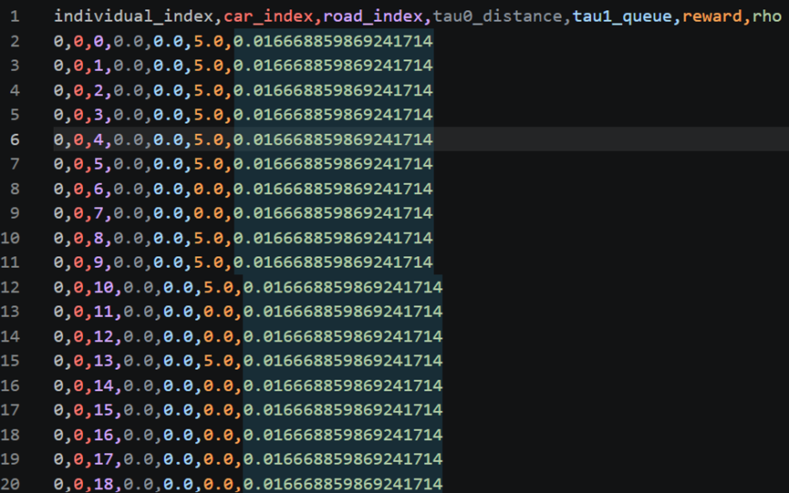
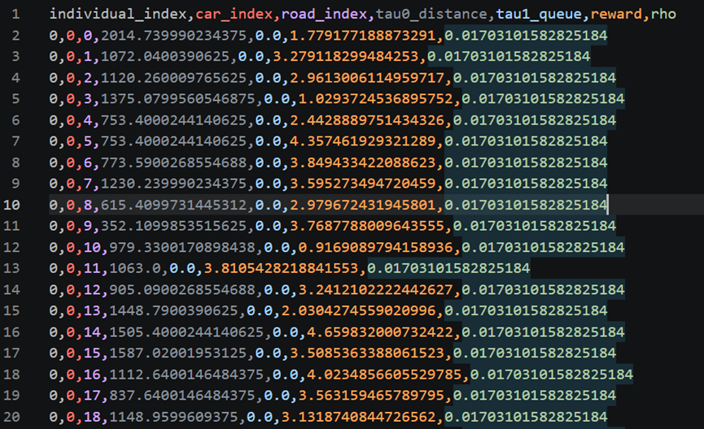
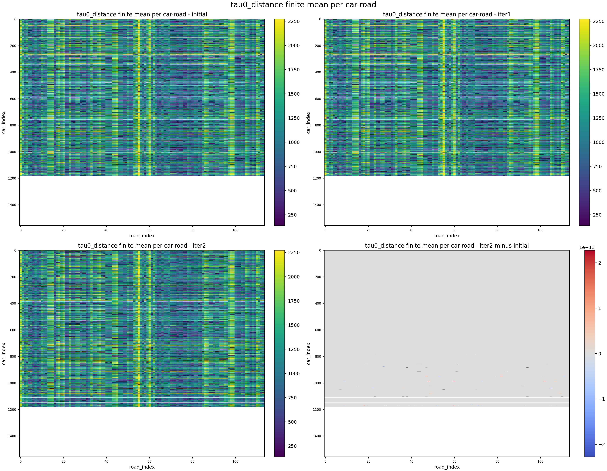
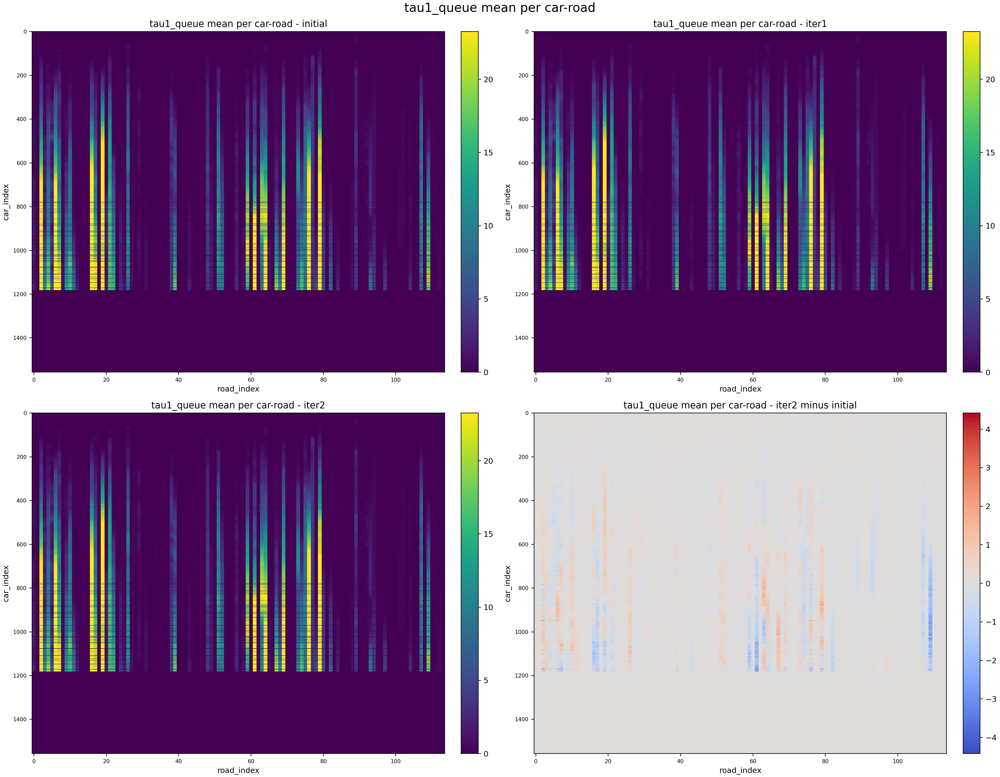
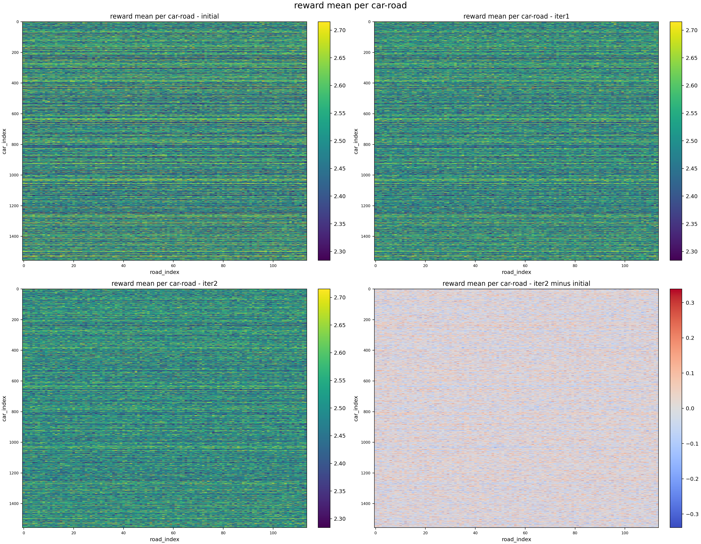
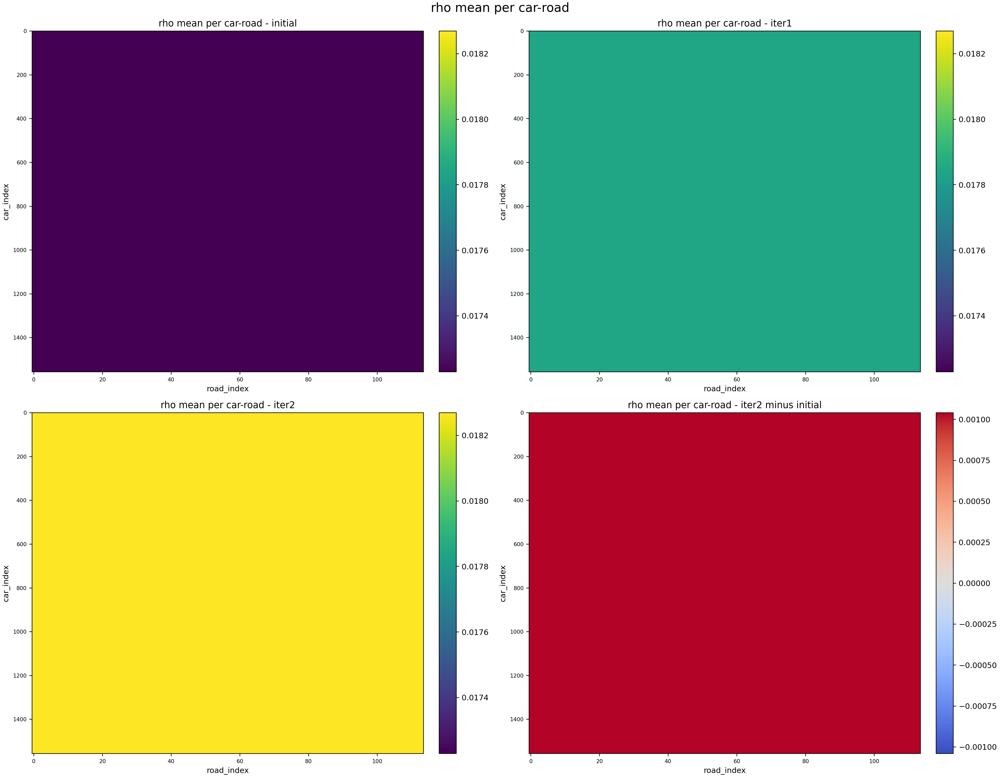
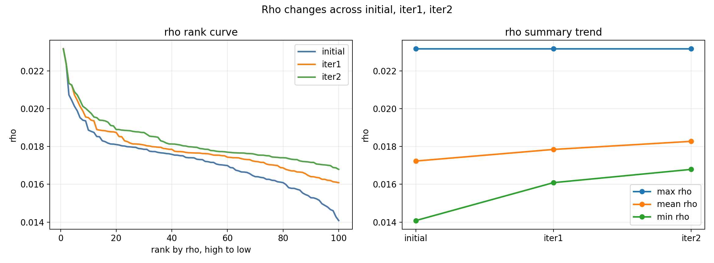

# 20260622

## 修改数据前

## 修改数据后

## reward 为 0 或 5 的原因

还没训练好的扩散模型直接拿来生成 `reward`，生成出来的值不稳定，超出设置的范围 `[0,5]`，被截到了边界 `0` 或 `5`。

## 修改

随机初始化扩散模型没有训练过，用 `tau` 作为条件实际输出也不容易学到有效值，直接随机生成 `0` 到 `5` 之间的连续值，使得 `reward` 是连续的，不会大量为 `0` 或 `5`，也使得初始种群有足够多样性，方便 DQN 仿真得到不同 `rho`。

## 思考

当前数据是初始种群阶段的数据，应该还要获取进化过程中产生的所有样本来做实验；或者再修改初始 `reward` 的生成，用有界映射把输出平滑压到 `[0, 5]`。

# 20260625

这四张图是在看 `tau0_distance`、`tau1_queue`、`reward` 和 `rho` 在对应车和路的位置上是怎么变的。横轴是 `road_index`，纵轴是 `car_index`，每个格子表示这个车路位置在 100 个个体里的平均值。右下角的图是 `iter2` 减去 `initial`，看的是差值，正数是变大了，负数是变小了。

## tau0_distance

tau0_distance 基本没怎么变，三代的颜色都差不多，这个距离值整体很稳定，右下角差值图里变化也很小，主要是一些很轻微的小改动，不是大变化。

## tau1_queue

`tau1_queue` 变化比较明显，能看到有些地方变亮了，有些地方变暗了，队列不是全都一起变大或者一起变小，而是某些车路位置上的队列在变。差值图里有明显的正负变化，有些地方队列增加了，有些地方队列减少了。

## reward

`reward` 看的是每个车路位置上的平均 reward。这个图里 reward 现在是连续的，不再是之前那种 0 和 5 乱跳的情况。有一些局部变化，但不是特别夸张，reward 主要是在一些地方小幅变化。

## rho

`rho` 明显整体都往上了一点，差值图也比较均匀。整个种群的质量是变好了，不是只有某几个点变强了，而是整体都抬高了一点。

# 20260701

一、先把MARL 小规划器训练出来 
二、再把它放进 LNS2，和几个基线方法做大规模对比 
三、最后再做一个接近真实仓库的实验，证明不是只会在仿真里跑

## 一、先把MARL 小规划器训练出来 

不管整个大系统，先把“局部重规划”这个小模块训练好。这个小模块就是论文里的 MARL 规划器。它不是负责整张大地图、所有机器人的全局路径规划，而是只负责一个小任务。

### 1.这个小任务是怎么来的

从一个完整的大任务里切出来的。

流程：
先生成一个完整的大 MAPF 实例（一张地图、一堆机器人、每个机器人有起点和终点）
用一个传统规划器，论文里是 PP+SIPPS，给所有机器人先算一版路径
然后从这些机器人里挑出一小部分，组成局部重规划问题
这小部分机器人是 RL 真正要管的对象
其他机器人虽然不归 RL 控制，但它们已经有了路径，所以会变成“移动中的背景障碍”

### 2.训练

第一阶段：让 MARL 学会最基础的局部协作。
随机抽局部任务
学习，逐步增加难度（逐渐增加机器人数量、逐渐增加障碍密度） 
模仿学习打底（在每个难度阶段刚开始的时候，用一个集中式规划器 ODrM* 给出示范解，让 RL 看看“比较好的路径大概是什么样”）
逐渐调整 reward（早期依赖参考路径，后期减少限制）
第二阶段：适应真实使用场景
训练时的局部任务生成方式尽量和真正运行 LNS2+RL 时一致(哪些机器人被选出来、局部路径怎么接回全局、更新以后怎么继续下一轮)

## 二、再把它放进 LNS2，和几个基线方法做大规模对比 

看MARL 小规划器放入完整系统里以后，整体到底有没有更强。
把LNS2原来那个局部重规划器，换成自己训练好的 MARL 模块。

LNS2：
1. 先给所有机器人弄一套初始路径
2. 这套路径可能有冲突
3. 然后每次挑出一小批机器人
4. 只重算这小批机器人的路径
5. 看冲突有没有减少
6. 反复做很多轮

### 完整流程：

1. 先生成全局初始解（用 PP+SIPPS 给整个大任务生成一套初始路径。）
2. 开始迭代修补
跑 LNS2 的大循环（每一轮都会从当前全局解里挑一批机器人出来，形成一个局部重规划子问题）
3. 前期优先用 MARL
早期问题还比较乱，冲突还比较多，这时候就让训练好的 MARL 模块来解这个局部重规划任务。MARL 会给出这几个机器人的新路径。
4. 补尾
如果 MARL 里有个别机器人没在规定步数内到终点，就交给 PP+SIPPS 给这些没走完的机器人补剩下的路。
5. 筛掉明显不划算的路径
如果 RL 某次给出的某些路径太长，代价太高，那这些路径也会被传统规划器重新替换。
6. 更新全局解
看这次局部重规划后，全局是不是更好了。如果更好，就接受更新；如果没更好，就不采用。
7. 继续下一轮
下一轮再挑新的局部子问题，继续修。
